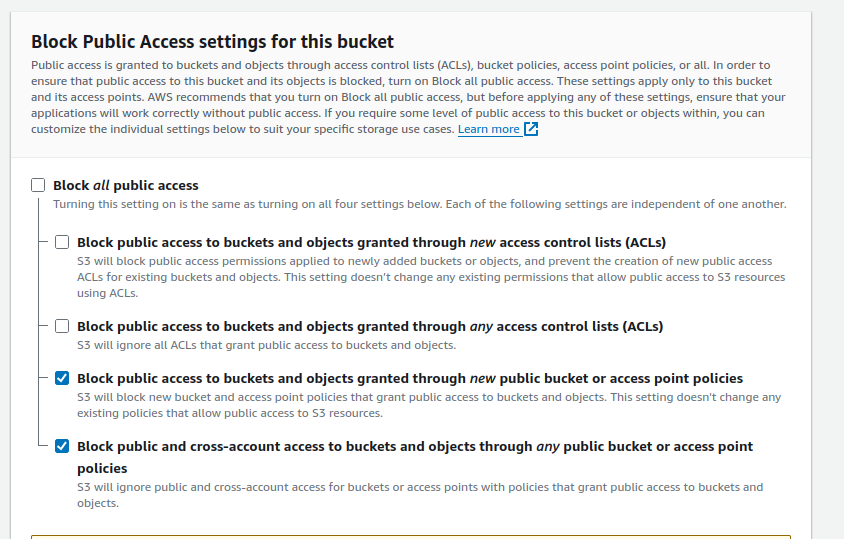
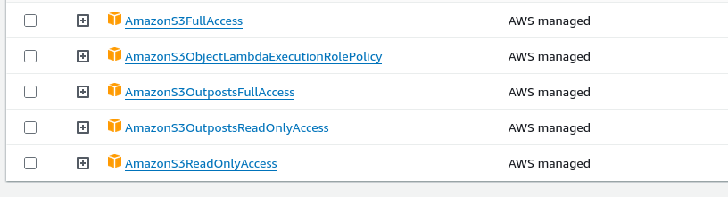

# File Manager for AWS S3 using Nodejs

## Functionality 
The file manager api helps the users to create folders, subfolders and upload files on AWS S3 bucket. It can also be used to generate a public link to share the files with your friends.
Additionally it has the basic functionalities such as -
1. Signup, Login (maintaned via JWT tokens)
2. Parent and Subfolder creation
3. Upload file to desired folder
4. list all files and folders ( can list inside a folder as well )
5. delete a particular file residing inside a folder/sub_folder
6. generate a public URL to share with your friends


## API Documentation
https://documenter.getpostman.com/view/26435485/2s9YsRd9cB

## Getting Started
To get a local copy up and running, please follow these simple steps.


### Prerequisites
- Node.js (Version: >=20.x)
- PostgreSQL and pgAdmin
- AWS Account
- Linux OS

### Setup
1. Clone the repo
```
git clone https://github.com/Gupta-Aryaman/file-manager.git
```

2. Go to the project folder
```
cd file-manager
```

3. Install dependencies
```
npm install
```

4. Create a database in postgresql and enter the host & db details in .env file *(keep DB_NAME = file_manager only)* 
```
DB_USER = postgres
DB_PASSWORD = postgres
DB_HOST = localhost
DB_PORT = 5432
DB_NAME = file_manager 
```

5. **AWS S3 Bucket Creation**- 
Create a bucket in AWS S3. Keep a note of the AWS Region and Bucket Name. Keep the Public Access Permissions as follows: 


> **Replace** < AWS_BUCKET_NAME > in .env with the BUCKET_NAME just created

6. **IAM User Creation and AWS config setup**- 
    - **STEP 1** Go to "IAM" in AWS Console. 
    - **STEP 2** Create a new user
    - **STEP 3** Select "Add user to group"
    - **STEP 4** Create a new group named "S3-full-access" and assign it the following permissions - 
    
    - **STEP 5** Select the newly created group in the user creation process
    - **STEP 6** Then click "Create User". New user has been created.
    - **STEP 7** Click on the newly created user
    - **STEP 8** Go to "Security credentials"
    - **STEP 9** Create an Access Key -> Local Code
    - **STEP 10** Keep a note of the *Access Key* and the *Secret Access Key*
    - **STEP 11** Open terminal of your local system and type the following command-
    ```
    mkdir -p ~/.aws && cd ~/.aws
    ```
    - **STEP 12** Create a new file using the following command
    ```
    gedit config
    ```
    Write the following in the file and replace the *region* with the S3 Bucket Region
    ```
    [default]
    region = <aws-s3-bucket-region>
    output = json
    ```
    - **STEP 13** Create a new file using the following command
    ```
    gedit credentials
    ```
    Write the following in the file and replace the *aws_access_key_id* with the ACCESS KEY of the IAM user and *aws_secret_access_key* with AWS SECRET ACCESS KEY of the IAM user.
    ```
    [default]
    aws_access_key_id = <access_key>
    aws_secret_access_key = <secret_access_key>
    ```

7. **Setting up the PostgreSQL Database** - 
    - Open pgAdmin -> create a server -> create database and put the database name **file_manager**
    - Right click the database **file_manager** and click on "Query Tool"
    - Copy the following commands and run them in the Query Tool one by one
    ```
    CREATE EXTENSION IF NOT EXISTS "uuid-ossp";
    ```
    ```
    CREATE TABLE users(
        user_id uuid PRIMARY KEY DEFAULT uuid_generate_v4(),
        user_name TEXT NOT NULL,
        user_email TEXT NOT NULL UNIQUE,
        user_password TEXT NOT NULL
    );
    ```
    ```
    CREATE TABLE files(
        file_id uuid PRIMARY KEY DEFAULT uuid_generate_v4(),
        file_name TEXT NOT NULL,
        file_path TEXT NOT NULL,
        file_owner uuid NOT NULL,
        FOREIGN KEY (file_owner) REFERENCES users(user_id)
    );
    ```


### Run the project
Run the project via 
```
npm run dev
```


